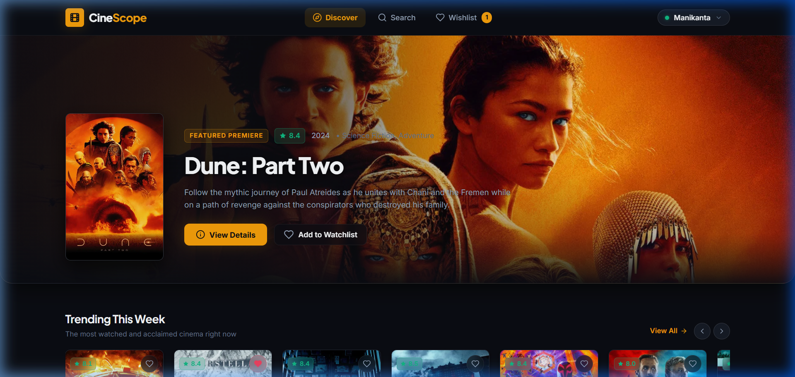
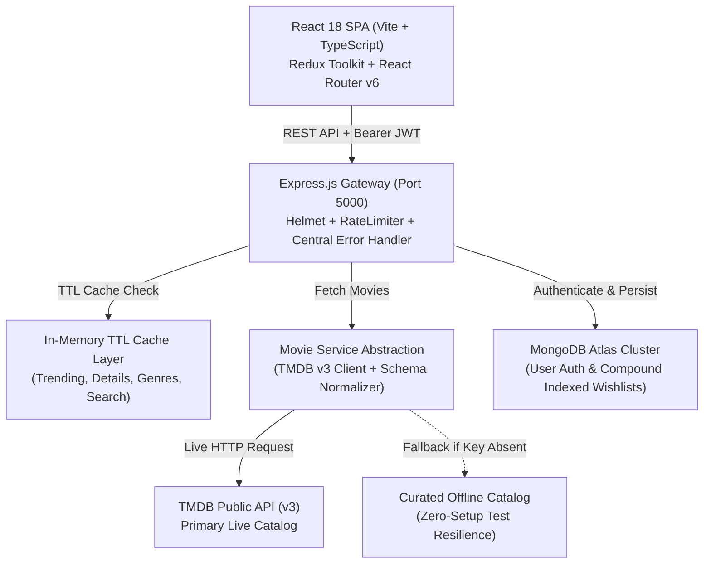
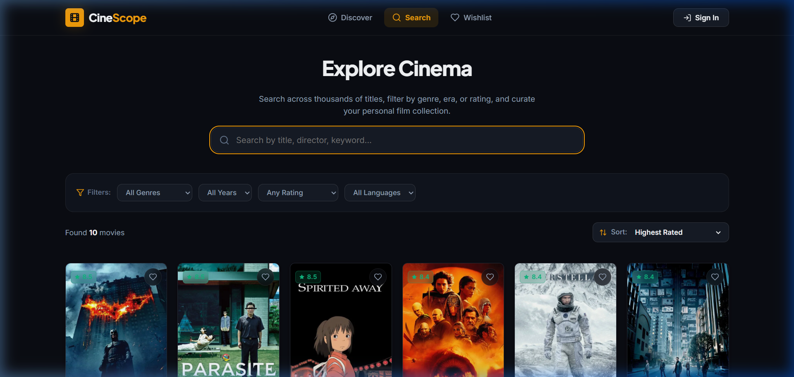
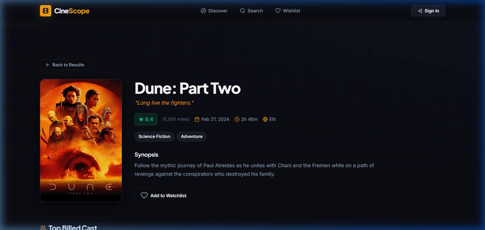
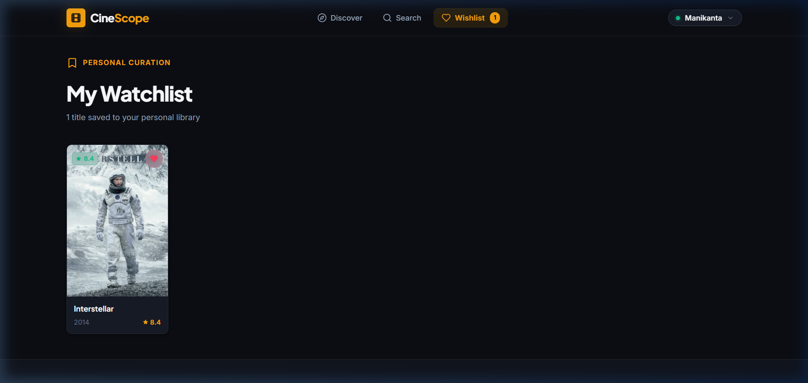
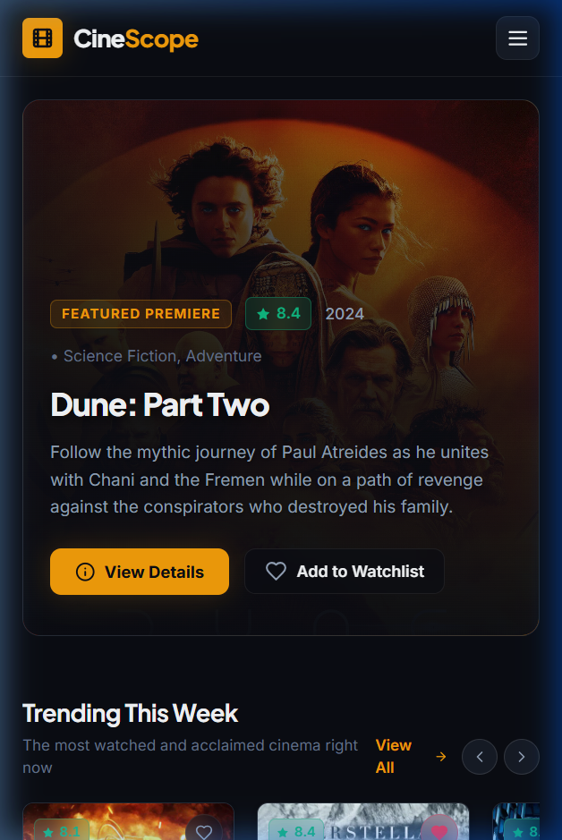

# CineScope

<div align="center">



> **Production-Grade Movie Discovery & Persistent Curation Platform**  
> Developed for the Full-Stack Developer Screening Assignment at **Trackzio Mobile Application Pvt Ltd**.

[](https://www.typescriptlang.org/)
[](https://react.dev/)
[](https://nodejs.org/)
[](https://expressjs.com/)
[](https://www.mongodb.com/)
[](https://www.themoviedb.org/)
[](https://vitest.dev/)
[](LICENSE)

</div>

---

## ✅ Assignment Requirements Coverage

| Requirement | CineScope Implementation | Status |
| :--- | :--- | :---: |
| **Movie discovery** | Trending, popular, top-rated, now playing, upcoming rails & grids | ✅ Full |
| **Third-party movie API** | TMDB v3 API integrated via Node.js service | ✅ Full |
| **Backend abstraction** | React $\rightarrow$ Express $\rightarrow$ TMDB data normalizer & cache | ✅ Full |
| **Search** | 400ms debounced server-side search with request cancellation | ✅ Full |
| **Filtering** | 19 Genres, release eras, ratings, original languages | ✅ Full |
| **Sorting** | Popularity, rating, release date, title (A-Z) | ✅ Full |
| **Pagination** | Server-side paginated results (up to 500 pages) | ✅ Full |
| **Movie details** | Backdrop, metadata pills, cast carousel, recommendations | ✅ Full |
| **Persistent wishlist** | Hybrid: Local-first `localStorage` + MongoDB Atlas cloud sync | ✅ Full |
| **Context preservation** | URL search state synchronization + browser history scroll restoration | ✅ Full |
| **Failure handling** | 8s timeout, curated offline fallback data, user retry UI | ✅ Full |
| **Large result sets** | Page-by-page streaming + in-memory TTL caching | ✅ Full |
| **Responsive UI** | Desktop, tablet, mobile fluid layouts & locked 2:3 poster ratios | ✅ Full |
| **Testing** | 28 automated tests (19 backend + 9 frontend) | ✅ Full |

---

## 📌 Submission Overview & Quick Links

| Resource | Production URL / Instructions |
| :--- | :--- |
| 🌐 **Live Web Application** | [https://cine-scope-9ro9.vercel.app](https://cine-scope-9ro9.vercel.app) |
| 🚀 **Live Backend API** | [https://cinescope-msp3.onrender.com](https://cinescope-msp3.onrender.com) |
| 📹 **Video Walkthrough Demo** | [Watch Demo Video](https://youtu.be/YOUR-ACTUAL-VIDEO-ID) *(replace with your recording link)* |
| 📊 **API Health & Status** | [`GET /api/health`](https://cinescope-msp3.onrender.com/api/health) |

**CineScope** is a full-stack movie discovery platform built with React, Node.js, Express, MongoDB, and TMDB, featuring persistent wishlists, intelligent search, caching, pagination, responsive UX, and resilient API handling.

---

## ⚡ Architectural Blueprint



### Core Architecture Highlights
1. **Strict Service Decoupling**: The React client **never** calls TMDB directly. All external movie requests flow through the backend gateway. This prevents client credential leaks, avoids CORS problems, and shields frontend components from upstream third-party API changes.
2. **TMDB Primary Data Source**: Live TMDB v3 API is the primary catalog. For automated testing and zero-setup evaluations, the service includes high-fidelity fallback data so core features work even if external API limits or network drops occur.
3. **Hybrid Local-First & Cloud Persistence**: Wishlist additions work seamlessly without mandatory authentication—guests can curate immediately to `localStorage` (surviving tab/browser reopen), with zero friction. Upon logging in or registering, guest-curated titles are automatically migrated and synchronized with MongoDB using an atomic compound unique index (`{ userId: 1, movieId: 1 }`).
4. **Context-Preserving Routing**: Searching, filtering, and paging are synchronized bidirectionally with browser URL search parameters (`useUrlState`). Users navigating from Movie Details back to search results return to the exact same query, page, and scroll context.

---

## 📸 Visual Showcase

| Full-Width Desktop Hero | Search, Multi-Filter & Sorting |
| :---: | :---: |
|  |  |

| Movie Details with Cast & Similar Titles | MongoDB-Persisted Watchlist |
| :---: | :---: |
|  |  |

<div align="center">

### Mobile Responsive Experience


</div>

---

## 🚀 Key Features

### 1. Cinematic Home & Discovery
- **Full-Width Hero Premiere**: Edge-to-edge backdrop showcase with responsive ambient gradient overlay (dark high-contrast left area for readability, vivid backdrop visibility on right).
- **Synchronized Horizontal Rails**: Smooth, snap-scrollable rails for **Trending This Week** and **Top Rated Masterpieces** with chevron arrows.
- **Card Metadata Hierarchy**: Every card cleanly displays Title, Year • Primary Genre, and numeric Rating Pill (`⭐ 8.1`) without overcrowding.
- **Functional Category Links**: Every section header features a working `View All →` button routing to the catalog with relevant filters pre-applied (e.g. `/search?sort=popularity`).

### 2. Search, Filter & Sort Engine
- **Debounced Search (400ms)**: Minimizes extraneous API requests by waiting for user pause.
- **Race Condition Prevention**: Employs `AbortController` cancellation to terminate in-flight Axios requests on new keystrokes, ensuring stale out-of-order responses never overwrite current results.
- **Multi-Attribute Filters**: Combine Genre (e.g. *Science Fiction*), Year (e.g. *2024*), Rating (e.g. *8.0+*), and Language (*English*, *Japanese*, *French*, etc.).
- **URL State Synchronization**: `/search?q=dune&genre=878&sort=rating&page=2` reflects full filter state in the URL bar, enabling shareable links, page reloads, and browser history preservation.

### 3. Movie Details (`/movies/:id`)
- Immersive cinematic backdrop with dark radial gradient blend.
- Key production metadata: Tagline, runtime (`2h 46m`), status, release date, rating badge, vote count, and spoken languages.
- Cast carousel showcasing top actors with headshots and character names.
- Related recommendations rail and similar titles discovery.
- Smart **"Back to Results"** button that pops the history stack (`navigate(-1)`) to preserve previous search queries and scroll position.

### 4. Persistent Watchlist & Hybrid Curation
- **Local-First Zero-Setup Guest Mode**: Any visitor can instantly curate movies to their persistent watchlist via `localStorage` without being forced to create an account. Saved movies survive browser refreshes, tab closures, and application restarts.
- **Automated Cloud Account Migration**: When a guest user logs in or registers, local titles are automatically migrated and synchronized up to MongoDB Atlas with atomic duplicate prevention.
- **Optimistic UI Updates**: Heart icon updates instantly (`♡ → ♥`) before network resolution, with automatic rollback and toast notification if an error occurs.
- **Database Uniqueness**: Guaranteed via `{ userId: 1, movieId: 1 }` compound index in MongoDB.
- **In-Library Search**: Fast client-side filtering within saved titles on `/wishlist`.

### 5. Authentication & Account Management
- Stateless JWT authentication with bcryptjs password hashing (10 salt rounds).
- Password hashes excluded from API queries by default (`select: false`).
- Minimal user trigger (`◉ Manikanta ▾`) with compact dropdown containing Profile info, My Wishlist link, and Sign Out.
- Contextual modal login enables users to sign in without losing their browsing position.

---

## 🛠 Tech Stack

| Layer | Technology | Rationale & Responsibility |
| :--- | :--- | :--- |
| **Frontend** | React 18, TypeScript, Vite | Fast build pipeline, strict compile-time types, component modularity |
| **State Management** | Redux Toolkit | Centralized state slices for `auth`, `wishlist`, and `ui` notifications |
| **Routing** | React Router v6 | Declarative client routing with `useUrlState` and `useNavigationType` |
| **HTTP Client** | Axios | Interceptors for JWT authorization header injection and 401 normalization |
| **Styling** | Vanilla CSS & CSS Variables | Tailored dark cinema design system without external bloat or runtime overhead |
| **Icons** | Lucide React | Clean, tree-shakable SVG iconography |
| **Backend** | Node.js, Express, TypeScript | High-performance REST service, clean MVC routing, centralized error handler |
| **Database** | MongoDB Atlas, Mongoose | Cloud document database, schema validation, compound indexing |
| **Security** | Helmet, CORS, Rate Limit, bcryptjs | Security headers, request rate limiting, credential hashing |
| **Testing** | Vitest, Supertest, Testing Library | Monorepo unit tests and integration test suites |

---

## 🔌 API Documentation

All endpoints are prefixed with `/api`.

### 🎬 Movie Endpoints (Public)
| Method | Endpoint | Query Parameters | Description | Cache TTL |
| :--- | :--- | :--- | :--- | :--- |
| `GET` | `/api/movies/trending` | `timeWindow` (day/week), `page` | Fetch trending titles | 10 min |
| `GET` | `/api/movies/popular` | `page` | Audience favorites worldwide | 10 min |
| `GET` | `/api/movies/top-rated` | `page` | Critically acclaimed titles (8.0+) | 10 min |
| `GET` | `/api/movies/now-playing` | `page` | Theatrical releases | 10 min |
| `GET` | `/api/movies/upcoming` | `page` | Anticipated coming soon titles | 10 min |
| `GET` | `/api/movies/search` | `q`, `genre`, `year`, `rating`, `language`, `sort`, `page` | Filtered search | 2 min |
| `GET` | `/api/movies/:id` | — | Movie details with cast & recommendations | 30 min |
| `GET` | `/api/genres` | — | Official TMDB genre mapping list | 24 hours |
| `GET` | `/api/health` | — | System health, database state, cache stats | Real-time |

### 🔐 Auth Endpoints
| Method | Endpoint | Body Payload | Description | Auth Required |
| :--- | :--- | :--- | :--- | :--- |
| `POST` | `/api/auth/register` | `{ "name", "email", "password" }` | Register new user account | No |
| `POST` | `/api/auth/login` | `{ "email", "password" }` | Authenticate & issue JWT | No |
| `GET` | `/api/auth/me` | — | Fetch current user session | Bearer Token |

### 💖 Wishlist Endpoints (Protected)
| Method | Endpoint | Headers | Body / Parameters | Description |
| :--- | :--- | :--- | :--- | :--- |
| `GET` | `/api/wishlist` | `Authorization: Bearer <token>` | — | Retrieve user watchlist |
| `POST` | `/api/wishlist` | `Authorization: Bearer <token>` | Movie object payload | Save movie to watchlist |
| `DELETE` | `/api/wishlist/:movieId` | `Authorization: Bearer <token>` | `movieId` in URL | Remove movie from watchlist |
| `GET` | `/api/wishlist/check/:movieId` | `Authorization: Bearer <token>` | `movieId` in URL | Check if movie is in watchlist |

---

## ⚙️ Local Setup & Installation

### Prerequisites
- **Node.js** v18.0.0 or higher
- **npm** v9.0.0 or higher
- **MongoDB**: Either a local MongoDB instance or a free [MongoDB Atlas](https://www.mongodb.com/cloud/atlas) connection URI. *(An in-memory database activates automatically if none is supplied).*
- **TMDB API Key**: Required for live movie data. Obtain a free v3 API key from [themoviedb.org](https://www.themoviedb.org/settings/api). *(A high-fidelity fallback catalog is automatically available when the external service is unavailable or key is absent for offline evaluation).*

### 1. Clone & Setup Environment
```bash
git clone https://github.com/TumpilliManikanta702/CineScope.git
cd CineScope

# Copy environment example
cp .env.example .env
```

Configure `.env`:
```env
PORT=5000
NODE_ENV=development
MONGODB_URI=mongodb+srv://<username>:<password>@cluster0.mongodb.net/cinescope?retryWrites=true&w=majority
JWT_SECRET=your_secure_random_secret_here
TMDB_API_KEY=your_tmdb_api_key_here
CLIENT_URL=http://localhost:5173
VITE_API_BASE_URL=http://localhost:5000/api
```

### 2. Install Dependencies
```bash
# Install root monorepo tooling
npm install

# Install backend dependencies
npm --prefix backend install

# Install frontend dependencies
npm --prefix frontend install
```

### 3. Run Development Servers
```bash
# Terminal 1: Start Backend API (Port 5000)
npm run dev:backend

# Terminal 2: Start Frontend Client (Port 5173)
npm run dev:frontend
```

Open **`http://localhost:5173`** in your browser.

---

## 🧪 Testing & Verification

CineScope includes **28 automated tests** (19 backend + 9 frontend) covering backend integration, database uniqueness, error scenarios, guest-to-cloud wishlist persistence, and frontend component states.

```bash
# Run both backend and frontend test suites (28 tests)
npm test

# Run backend tests only (19 tests)
npm run test:backend

# Run frontend tests only (9 tests)
npm run test:frontend

# Run full TypeScript typecheck across monorepo
npm run typecheck

# Build both production bundles
npm run build
```

### Test Coverage Summary
- **Auth Suite (6 Tests)**: Registration, email collision (`409`), credential verification, bad password rejection (`401`), JWT decoding, unauthenticated profile rejection.
- **Wishlist Suite (5 Tests)**: Unauthenticated denial (`401`), addition, duplicate wishlist prevention (`409`), retrieval, deletion.
- **Movie Suite (8 Tests)**: Trending pagination, rail discovery, movie details resolution, 404 handler, query/filter searching, genre mapping.
- **Frontend Component Suite (3 Tests)**: `MovieCard` metadata rendering, missing poster fallbacks, accessible wishlist toggle button with aria labels.
- **Common UX Suite (3 Tests)**: `EmptyState` CTA actions, `ErrorState` retry handler, `SearchBar` 400ms debounce verification.
- **Guest Wishlist Suite (3 Tests)**: Guest movie saving to localStorage without mandatory login, wishlist toggling/removal, and `/wishlist` guest curation banner presentation.

---

## 💬 Technical Decisions & Interview Talking Points

### 1. Why decouple frontend from TMDB?
Direct client calls to third-party APIs leak private API keys in client network tabs and bundles. Decoupling routes all traffic through a backend gateway where keys are hidden, incoming requests are rate-limited, responses are cached in memory, and payloads are normalized into uniform TypeScript types.

### 2. Why MongoDB for the database?
Only application-specific relational data (user profiles and user-curated watchlists) is stored. MongoDB's flexible document model maps directly to TypeScript interfaces. Its compound unique index `{ userId: 1, movieId: 1 }` efficiently enforces uniqueness at the database level and prevents duplicate wishlist entries even under concurrent requests.

### 3. Why not store the entire movie database in MongoDB?
TMDB maintains a large continuously updated movie catalog with ratings, vote counts, release information, and cast metadata. Synchronizing the entire external movie catalog locally introduces stale data, cache invalidation headaches, and wasted storage. Storing only user-generated entities is industry standard.

### 4. How are excessive API requests prevented?
- **400ms Debounce**: Postpones search requests until typing pauses.
- **AbortController**: Terminates outdated HTTP requests when new keystrokes are registered.
- **In-Memory TTL Caching**: Frequently accessed endpoints are cached for short periods (2–10 minutes), reducing redundant TMDB requests and improving response time.
- **Redux State Sync**: Active wishlist movie IDs are maintained in memory to check saved status without extra roundtrips.

### 5. What if TMDB is temporarily unavailable?
The backend service catches timeouts and upstream HTTP errors gracefully, returning structured, user-friendly JSON payloads rather than leaking unhandled 500 exceptions. The frontend renders an `ErrorState` component with a direct retry button.

### 6. Windows Node.js DNS SRV Resolution Bug Fix
When the initial SRV resolution fails in affected Windows development environments, CineScope retries DNS resolution using explicitly configured DNS servers (such as 8.8.8.8). This provides a development-time workaround for certain local DNS resolution issues.

### 7. Why a Hybrid Persistence Model (Local-First Guest Storage + Cloud Sync)?
In modern consumer discovery apps, forcing users to register before they can perform lightweight curation introduces immediate user friction. CineScope implements a local-first pattern: unauthenticated visitors can curate movies immediately into `localStorage`, surviving browser closures and page reloads. The moment they register or log in, the client's `syncGuestWishlist` engine automatically commits those titles into MongoDB Atlas under their account, delivering zero friction for new visitors and cloud persistence for returning members.

---

## ⚠️ Known Limitations & Tradeoffs

1. **In-Memory vs. Distributed Cache**: The current cache uses an in-memory Map with TTL expiration. While optimal for single-instance deployments, horizontal scaling across multiple instances would require migrating to a shared **Redis** or **KeyDB** instance.
2. **Single Provider**: The application integrates TMDB v3. Integrating additional providers (OMDb, JustWatch) would allow comparing streaming availability across regions.
3. **SPA Client Routing**: When deploying to static hosts (Vercel/Netlify), an SPA rewrite rule (`vercel.json` or `_redirects`) is required to route deep links (`/movies/:id`) to `index.html`.

---

## 🤖 AI Usage Disclosure

In adherence to academic and industry evaluation standards:
- **Pair-Programming Tooling**: This project was developed with assistance from **Google Antigravity / Gemini**.
- **Scope of AI Usage**: Scaffolding repetitive boilerplate, validating edge-case scenarios, generating initial unit test mocks, and refining documentation structure.
- **Engineering Ownership**: System architecture, data modelling, component structure, security implementations (bcrypt/JWT/Helmet), compound database indexing, responsive layout engineering, and debugging (such as the Windows DNS SRV fallback) were architected, reviewed, and tested line-by-line by the candidate.

---

## 🌐 Production Deployment Guide

### Deploying Frontend (Vercel)
1. Push repository to GitHub.
2. Connect repo to [Vercel](https://vercel.com).
3. Set **Root Directory** to `frontend`.
4. Build settings:
   - **Build Command**: `npm run build`
   - **Output Directory**: `dist`
5. Set Environment Variable:
   - `VITE_API_BASE_URL`: URL of your deployed backend API (e.g. `https://cinescope-api.onrender.com/api`).
6. Add `frontend/vercel.json` for SPA rewrites:
   ```json
   { "rewrites": [{ "source": "/(.*)", "destination": "/index.html" }] }
   ```

### Deploying Backend (Render / Railway)
1. Connect repo to [Render](https://render.com) or [Railway](https://railway.app).
2. Set **Root Directory** to `backend`.
3. Build & Start commands:
   - **Build Command**: `npm run build`
   - **Start Command**: `npm start`
4. Set Environment Variables:
   - `NODE_ENV`: `production`
   - `PORT`: `5000`
   - `MONGODB_URI`: Your production MongoDB Atlas connection string.
   - `JWT_SECRET`: High-entropy random production secret string.
   - `TMDB_API_KEY`: Your private TMDB v3 API key.
   - `CLIENT_URL`: URL of your deployed Vercel frontend.

---

## 📄 License & Attribution

- Released under the [MIT License](LICENSE).
- Movie metadata, posters, and imagery provided by **The Movie Database (TMDB)**. *This product uses the TMDB API but is not endorsed or certified by TMDB.*
