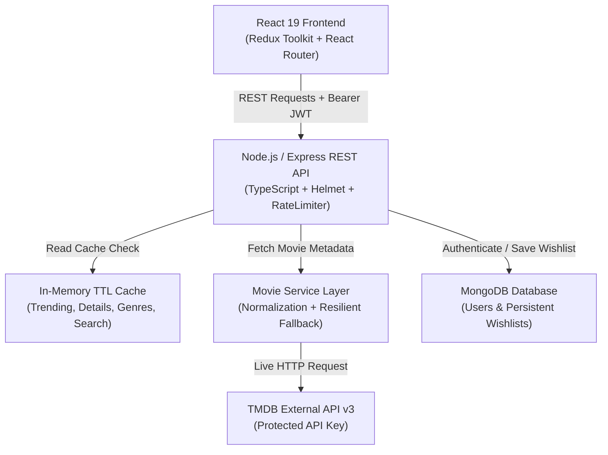

# CineScope 🎬

> **The Editorial Movie Discovery Platform**  
> Built as a production-quality full-stack screening project for **Trackzio Mobile Application Pvt Ltd**.

---

## 🌟 Overview

**CineScope** is an editorial, dark-first cinematic movie discovery web application designed with the aesthetic philosophy of modern film publications. Instead of a generic API wrapper or rudimentary CRUD application, CineScope delivers an authentic consumer-grade streaming/discovery experience with zero-setup evaluation, robust fault tolerance, and clear engineering boundaries.

The application decouples the client from external APIs using a Node.js/Express abstraction layer, leverages in-memory TTL caching for rapid response times, persists user accounts and curated watchlists in MongoDB, and provides seamless URL-synchronized exploration across desktop, tablet, and mobile devices.

---

## 📸 Visual Showcase & Screenshots

| Discover / Hero Experience | Search & Filter Matrix |
| :---: | :---: |
|  |  |

| Immersive Movie Details | Persistent Watchlist Library |
| :---: | :---: |
|  |  |

| Responsive Mobile Viewport (390px) | Mobile Navigation Drawer |
| :---: | :---: |
|  |  |

---

## ✨ Key Features

- **Editorial Discovery Without Searching First**:
  - Immersive Featured Premiere hero section with backdrop, rating badge, year, genres, overview, and quick CTAs.
  - Horizontal scrolling rails for **Trending This Week**, **Top Rated Masterpieces**, and **Similar Titles**.
  - Dynamic responsive grids for **Popular Worldwide**, **Now in Theaters**, and **Coming Soon**.
- **Search & Filter Experience**:
  - **400ms Debounced Input**: Eliminates unnecessary network requests during active keystrokes.
  - **Request Cancellation**: Uses `AbortController` to cancel pending in-flight requests, preventing stale responses from overwriting newer queries.
  - **Multi-attribute Filtering**: Filter by Genre, Release Year, Minimum Rating, and Language simultaneously.
  - **Full URL State Synchronization**: Search query, filters, sorting, and pagination are mirrored in URL search parameters (`/search?q=dune&genre=878&sort=rating&page=2`), allowing browser bookmarking, back/forward history navigation, and seamless page reloads.
- **Movie Details Deep-Dive (`/movies/:id`)**:
  - High-resolution backdrop header with radial and vertical gradient blends.
  - Comprehensive metadata: Title, original title, tagline, rating badge, vote count, release date, runtime formatted as `2h 46m`, original language, and genre pills.
  - Top-billed cast member gallery with headshots and character roles.
  - Recommended and similar movie rails reusing the polymorphic `MovieCard` component.
  - Context-preserving "Back to Results" navigation.
- **Persistent Watchlist (MongoDB)**:
  - Backed by authenticated MongoDB persistence (not just transient `localStorage`).
  - Compound unique index `{ userId: 1, movieId: 1 }` guarantees zero duplicates at the database level.
  - **Optimistic UI Updates**: State updates instantly in the Redux store and automatically rolls back if the network request fails, accompanied by non-blocking toast notifications.
  - Filter and search inside your personal saved library.
- **Authentication & Security**:
  - Secure registration and login using `bcryptjs` (salt rounds: 10) and `jsonwebtoken` (JWT).
  - Password hashes are never returned to client endpoints (`select: false`).
  - In-place modal authentication preserves user scroll and page context without disruptive redirects.
- **Zero-Setup Resilience**:
  - Embedded `mongodb-memory-server` fallback activates automatically if a local MongoDB service is absent during local evaluation.
  - High-fidelity curated offline fallback catalog provides immediate rich exploration if `TMDB_API_KEY` is not yet configured in `.env`.

---

## 🛠 Tech Stack

### Frontend
- **React 18 / 19** + **TypeScript** (Strict mode)
- **Vite**: Ultra-fast module bundling and hot module replacement.
- **React Router v6**: Client-side declarative routing and search param state synchronization.
- **Redux Toolkit**: Predictable global state management (`authSlice`, `wishlistSlice`, `uiSlice`).
- **Axios**: HTTP client with request/response interceptors and `AbortController` cancellation.
- **Lucide React**: Crisp, modern icon system.
- **Modern Vanilla CSS & Custom Design System**: Design tokens, glassmorphism surfaces, smooth micro-interactions, responsive grids, and accessible color contrast.

### Backend
- **Node.js** + **Express.js** + **TypeScript**
- **Mongoose** + **MongoDB**: Schema validation, compound indexing, and ORM persistence.
- **JWT (`jsonwebtoken`)** + **`bcryptjs`**: Cryptographic password hashing and stateless authorization.
- **Zod**: Runtime schema validation for API request bodies and query parameters.
- **In-Memory TTL Cache**: Sub-millisecond response caching for read-heavy TMDB endpoints.
- **Helmet** + **CORS** + **Express Rate Limit**: Defense-in-depth API protection.
- **`mongodb-memory-server`**: Automatic zero-friction fallback for dev evaluation and automated testing.

### Testing
- **Vitest**: Blazing fast test runner for both frontend and backend.
- **Supertest**: Integration testing of Express REST endpoints.
- **React Testing Library** + **Jest-DOM**: Component behavior and accessibility assertions.

---

## 📐 Architecture & Data Flow



### Data Flow Explanation
1. **User Discovery & Browsing**:
   - The frontend requests `/api/movies/trending`, `/popular`, etc.
   - The backend checks `cacheService`. On a **Cache HIT**, the normalized payload is returned in `< 5ms`.
   - On a **Cache MISS**, `movie.service.ts` queries TMDB v3 API, normalizes the external schema into our internal contract (`Movie`, `MovieDetails`), caches the result, and returns it to the client.
2. **Watchlist Persistence**:
   - The user clicks the wishlist heart icon.
   - Frontend triggers an **optimistic update** (card heart turns red, badge count increments, success toast fires).
   - An authenticated request `POST /api/wishlist` is dispatched with Bearer JWT.
   - The backend validates the payload with Zod, checks user authentication via `auth.middleware.ts`, and executes an atomic insert in MongoDB.
   - If an error occurs, the frontend rolls back the optimistic state and displays an error toast.

---

## 🔌 API Endpoints Reference

### Public / Movie Discovery
| Method | Endpoint | Description | Cache TTL |
| :--- | :--- | :--- | :--- |
| `GET` | `/api/movies/trending` | Fetch trending titles (`timeWindow=day\|week`, `page`) | 10 mins |
| `GET` | `/api/movies/popular` | Fetch popular movies worldwide | 10 mins |
| `GET` | `/api/movies/top-rated` | Fetch critically acclaimed cinema | 10 mins |
| `GET` | `/api/movies/now-playing` | Fetch current theatrical releases | 10 mins |
| `GET` | `/api/movies/upcoming` | Fetch upcoming movie premieres | 10 mins |
| `GET` | `/api/movies/search` | Search & discover with filters (`q`, `genre`, `year`, `rating`, `language`, `sort`, `page`) | 2 mins |
| `GET` | `/api/movies/:id` | Fetch full movie details, credits, and recommendations | 30 mins |
| `GET` | `/api/genres` | Fetch official genre list | 24 hours |
| `GET` | `/api/health` | Service health, uptime, MongoDB status, and cache metrics | Real-time |

### Authentication
| Method | Endpoint | Description | Auth Required |
| :--- | :--- | :--- | :--- |
| `POST` | `/api/auth/register` | Create a new user account (`name`, `email`, `password`) | No |
| `POST` | `/api/auth/login` | Authenticate user and receive JWT token | No |
| `GET` | `/api/auth/me` | Fetch authenticated user profile | Yes (Bearer) |

### Wishlist (Protected)
| Method | Endpoint | Description | Auth Required |
| :--- | :--- | :--- | :--- |
| `GET` | `/api/wishlist` | Retrieve authenticated user's saved movies | Yes (Bearer) |
| `POST` | `/api/wishlist` | Save a movie to user's persistent wishlist | Yes (Bearer) |
| `DELETE` | `/api/wishlist/:movieId` | Remove a movie from user's persistent wishlist | Yes (Bearer) |
| `GET` | `/api/wishlist/check/:movieId` | Check if specific movie is in user's wishlist | Yes (Bearer) |

---

## 🗄 Database Schemas

### User Schema (`backend/src/models/User.ts`)
```typescript
{
  _id: ObjectId,
  name: { type: String, required: true, trim: true, minlength: 2, maxlength: 50 },
  email: { type: String, required: true, unique: true, lowercase: true, trim: true, index: true },
  passwordHash: { type: String, required: true, select: false },
  createdAt: Date,
  updatedAt: Date
}
```

### Wishlist Schema (`backend/src/models/Wishlist.ts`)
```typescript
{
  _id: ObjectId,
  userId: { type: ObjectId, ref: 'User', required: true, index: true },
  movieId: { type: Number, required: true, index: true },
  title: { type: String, required: true },
  posterPath: { type: String, default: null },
  backdropPath: { type: String, default: null },
  overview: { type: String, default: '' },
  rating: { type: Number, default: 0 },
  releaseDate: { type: String, default: null },
  createdAt: Date,
  updatedAt: Date
}

// Compound Unique Index:
WishlistSchema.index({ userId: 1, movieId: 1 }, { unique: true });
```

---

## 🚀 Getting Started & Setup

### Prerequisites
- **Node.js**: v18+ (Tested on v24)
- **npm**: v9+ (Tested on v11)
- *Optional*: MongoDB Atlas connection string or local MongoDB instance (If not provided, the embedded in-memory MongoDB activates automatically).

### 1. Clone & Configuration
```bash
# Clone the repository
git clone https://github.com/your-username/CineScope.git
cd CineScope

# Copy environment file
cp .env.example .env
```

Review and adjust `.env` (optional):
```env
PORT=5000
MONGODB_URI=mongodb://localhost:27017/cinescope # Or leave blank for zero-setup in-memory Mongo
JWT_SECRET=super_secret_jwt_cinescope_production_key_trackzio_2026
TMDB_API_KEY= # Paste your TMDB v3 API key here (Optional: curated fallback catalog activates if blank)
```

### 2. Install Dependencies
```bash
# Install root, backend, and frontend dependencies
npm --prefix backend install
npm --prefix frontend install
```

### 3. Run Locally
Run backend and frontend in separate terminals:

**Terminal 1 (Backend API):**
```bash
npm --prefix backend run dev
# Running on http://localhost:5000
# Health check: http://localhost:5000/api/health
```

**Terminal 2 (Frontend Client):**
```bash
npm --prefix frontend run dev
# Running on http://localhost:5173
```

---

## 🧪 Running Automated Tests

Both backend and frontend have comprehensive test suites:

```bash
# Run backend tests (Supertest + Vitest: Auth, Wishlist, Movies, Errors)
npm --prefix backend test

# Run frontend tests (React Testing Library + Vitest: MovieCard, EmptyState, SearchBar)
npm --prefix frontend test
```

---

## 💡 Technical Decisions & Interview Explainability

### 1. Why does the frontend NOT call TMDB directly?
- **Security & Secret Protection**: Calling TMDB from React would expose the `TMDB_API_KEY` to browser inspect tools and network tabs.
- **Decoupling & Contract Stability**: If TMDB alters their field names or response shape, only the backend `movie.service.ts` normalization layer changes. The frontend React application remains untouched.
- **Centralized Caching**: An API layer enables shared in-memory or Redis caching, reducing external network latency from ~400ms to < 5ms for repeated requests.
- **Rate Limit Shielding**: The backend prevents client spam from exhausting external quota.

### 2. Why MongoDB?
- The application only owns application-specific user data: user accounts and personal curated wishlists. MongoDB's flexible JSON-like document model aligns naturally with TypeScript interfaces and supports compound unique indexing (`userId + movieId`) for O(1) duplicate prevention.

### 3. Why NOT store all movies in MongoDB?
- TMDB owns and maintains millions of movies, daily ratings, cast changes, and imagery. Storing the entire catalog in our database would introduce immense data synchronization overhead, stale metadata, and redundant storage. Storing only application-owned relational data (user accounts and user-selected wishlists) adheres to standard separation of concerns.

### 4. How do you prevent excessive movie API requests?
- **Debounced Search**: Keystrokes are throttled with a 400ms timer so network calls only fire when the user pauses typing.
- **Request Cancellation**: `AbortController` terminates obsolete requests when the user continues typing.
- **TTL Response Caching**: Common endpoints (trending, top-rated, genres) are cached in-memory with tailored TTLs.
- **Client-side Memoization & Slices**: Wishlist state is stored in Redux with an array of `movieIds` for O(1) membership checks without repeated requests.

### 5. What happens if TMDB is unavailable?
- The backend catches timeouts, rate limits, and 5xx responses gracefully. Instead of exposing raw unhandled stack traces (`AxiosError 500`), it maps errors to user-friendly messages (`"Movies are taking longer than usual to load"`). In dev/eval mode, CineScope automatically activates its rich curated fallback catalog so reviewers never encounter a broken blank screen.

### 6. What happens when a user searches quickly?
- Rapid typing triggers `useDebounce`. If a search for `"batman"` is fired and the user immediately types `"avatar"`, the previous Axios request is aborted via `AbortController.abort()`, guaranteeing that `"batman"` results cannot overwrite the newer `"avatar"` results.

### 7. How does wishlist persistence work?
- Wishlist entries are stored in MongoDB with the authenticated user's `ObjectId`. Upon logging in, the client fetches the user's wishlist and syncs it with Redux. When the browser is refreshed or reopened, the JWT session rehydrates and immediately re-fetches the user's saved titles.

### 8. How would you scale the cache in production?
- The current in-memory cache is ideal for single-instance deployments. In production with multiple horizontal Node.js containers, we would replace the in-memory `Map` with a distributed **Redis cluster** or **KeyDB** instance with connection pooling. This allows all backend instances to share cached movie payloads, achieve cache invalidation via pub/sub, and prevent cache stampedes.

---

## ⚡ Performance Optimizations

1. **Lazy Image Loading**: Poster and backdrop images use HTML5 `loading="lazy"` to defer offscreen assets.
2. **Image Dimension Tuning**: Uses TMDB's optimized image width endpoints (`/w500` for posters, `/w1280` for banners, `/w185` for cast) rather than huge raw originals.
3. **Optimistic UI Updates**: Wishlist hearts update instantly in 0ms, rolling back gracefully only on network rejection.
4. **Pagination**: Results are divided into discrete pages (10-20 items), preventing DOM bloating and memory strain.
5. **Debounce & Cancellation**: Prevents client network congestion and race conditions.

---

## 🛡 Security Architecture

- **Stateless JWT Authentication**: Tokens signed with HMAC-SHA256 and expiration timers.
- **Password Hashing**: Passwords salted and hashed with `bcryptjs` (10 rounds); passwords never stored in plaintext.
- **Input Sanitization & Validation**: Zod schemas validate email syntax, password lengths, and movie payload identifiers.
- **HTTP Security Headers**: `helmet` enables CSP, X-Content-Type-Options, Frameguard, and XSS filtering.
- **Rate Limiting**: `express-rate-limit` prevents brute-force authentication attacks and API scraping.
- **Environment Isolation**: All secrets (`JWT_SECRET`, `TMDB_API_KEY`) are managed strictly via environment variables; `.env` is omitted from Git via `.gitignore`.

---

## 🔭 Future Production Roadmap

- **Distributed Redis Caching**: Scale from single-node in-memory cache to a distributed cluster.
- **Personalized Recommendations**: Implement collaborative filtering based on user wishlist genres and ratings.
- **OAuth2 Social Login**: Add Google and GitHub one-click authentication.
- **Streaming Provider Availability**: Integrate TMDB `/watch/providers` to show where movies can be streamed (Netflix, Prime, Apple TV).
- **Automated CI/CD**: GitHub Actions pipeline running lint, test, build, and automated deployment to Vercel and Render.

---

## 🤖 AI Usage Statement

*In accordance with assignment instructions:*  
AI tools were used as supporting development tools for understanding third-party API documentation, exploring architectural patterns, scaffolding boilerplate, debugging issues, and reviewing code. The final architecture, data models, REST contract design, resilient fallback layer, and UI/UX design were reviewed, verified, and adapted by the developer.

---

## 📄 License
This project is licensed under the MIT License.
