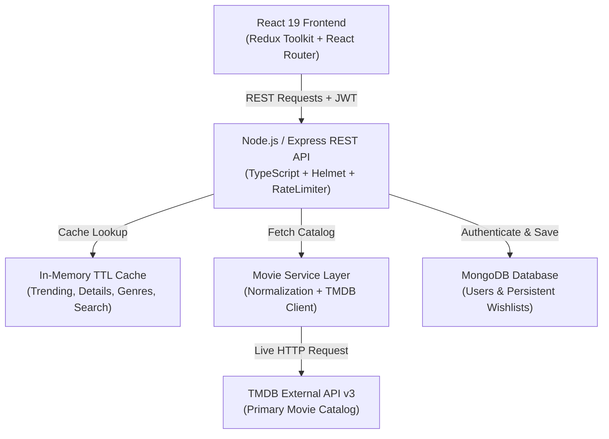

# CineScope

> **Full-Stack Movie Discovery & Persistent Curation Platform**  
> Developed for the Full-Stack Developer screening assignment at **Trackzio Mobile Application Pvt Ltd**.

CineScope is a production-quality movie discovery platform built with **React, TypeScript, Node.js, Express, MongoDB, and the TMDB API**. It features persistent user watchlists, debounced multi-attribute search, in-memory TTL caching, URL state synchronization, responsive layouts, and resilient API error handling.

---

## ⚡ Quick Architecture Overview



- **Frontend Decoupling**: The React client never calls TMDB directly. All external movie interactions pass through the backend service layer, protecting API credentials and shielding the UI from external schema changes.
- **External API Resilience**: **TMDB is the primary movie data source.** For local evaluation and automated test suites, the application incorporates controlled fallback data when external credentials or networks are unavailable, allowing core workflows to be verified reliably without external dependencies.
- **Persistent Storage**: User accounts and watchlists are persisted in MongoDB with atomic duplicate prevention (`userId + movieId` compound unique index).

---

## 📸 Screenshots

| Discover / Hero Experience | Advanced Search & Filters |
| :---: | :---: |
|  |  |

| Movie Details (`/movies/:id`) | Persistent Watchlist |
| :---: | :---: |
|  |  |

---

## 🚀 Key Features

### 1. Movie Discovery (Home)
- **Hero Premiere**: Featured movie showcase with dynamic backdrop, rating badge, year, genres, overview, and direct action buttons.
- **Horizontal Rails**: Scrollable carousels for **Trending This Week** and **Top Rated Masterpieces** with left/right chevron navigation.
- **Curated Grids**: Multi-row responsive grids for **Popular Worldwide**, **Now in Theaters**, and **Coming Soon**.
- **Resilient Cards**: Polymorphic `MovieCard` component with smooth hover lift, image fallback on missing/broken posters, and rating badges.

### 2. Search, Filters & Sorting
- **Debounced Search (400ms)**: Minimizes API traffic by delaying queries until the user finishes typing.
- **Request Cancellation**: Cancels in-flight Axios requests via `AbortController` so rapid keystrokes never cause out-of-order response overwrites.
- **Multi-attribute Filtering**: Combine Genre, Release Year, Minimum Rating, and Language filters.
- **Sorting**: Sort by Popularity, Rating, Release Date (Newest/Oldest), or Title (A-Z).
- **URL Synchronization**: `/search?q=dune&genre=878&sort=rating&page=2` reflects state in the address bar, enabling bookmarks, reloads, and browser back/forward navigation.

### 3. Movie Details (`/movies/:id`)
- Full-width backdrop header with radial dark gradient overlays.
- Key metadata: Title, original title, tagline, rating, vote count, release date, formatted runtime (e.g., `2h 46m`), status, and language.
- Top-billed cast member carousel with photos and character roles.
- Related movie recommendations and similar titles rails.
- Context-preserving "Back to Results" navigation.

### 4. Persistent Watchlist (MongoDB)
- Authenticated users can add or remove titles with immediate **optimistic UI updates** and automatic rollback on failure.
- Backed by MongoDB with a compound unique index `{ userId: 1, movieId: 1 }` preventing duplicates at the database level.
- Search and filter within saved titles.
- Contextual empty state with a "Discover Movies" call-to-action.

### 5. Authentication & Security
- User registration and login using stateless JWT and `bcryptjs` (10 rounds).
- Password hashes excluded from API responses by default (`select: false`).
- In-place authentication modal allows sign-in/up without losing the current viewing position.
- Centralized error handler returning structured, user-friendly JSON messages.

---

## 🛠 Tech Stack

| Layer | Technology | Purpose |
| :--- | :--- | :--- |
| **Frontend** | React 18 / 19, TypeScript, Vite | UI components, strict typing, build tool |
| **Routing & State** | React Router v6, Redux Toolkit | Declarative routing, global auth/wishlist/UI store |
| **HTTP Client** | Axios | API communication, interceptors, request cancellation |
| **Icons & Styling** | Lucide React, Modern CSS Tokens | Design system, dark cinematic palette, animations |
| **Backend** | Node.js, Express, TypeScript | REST API, service abstraction layer, middleware |
| **Database** | MongoDB, Mongoose | User and watchlist data persistence, indexing |
| **Security** | JWT, bcryptjs, Helmet, Express Rate Limit | Auth tokens, hashing, security headers, rate limiting |
| **Validation** | Zod | Runtime schema validation for request payloads |
| **External API** | TMDB API (v3) | Primary external movie data catalog |
| **Testing** | Vitest, Supertest, Testing Library | Unit tests, API integration tests, component tests |

---

## 🔌 API Reference

### Movies & Discovery (Public)
| Method | Endpoint | Description | Cache TTL |
| :--- | :--- | :--- | :--- |
| `GET` | `/api/movies/trending` | Weekly or daily trending movies (`timeWindow`, `page`) | 10 min |
| `GET` | `/api/movies/popular` | Popular movies worldwide (`page`) | 10 min |
| `GET` | `/api/movies/top-rated` | Critically acclaimed titles (`page`) | 10 min |
| `GET` | `/api/movies/now-playing` | Movies currently in theaters (`page`) | 10 min |
| `GET` | `/api/movies/upcoming` | Upcoming theatrical releases (`page`) | 10 min |
| `GET` | `/api/movies/search` | Search with filters (`q`, `genre`, `year`, `rating`, `language`, `sort`, `page`) | 2 min |
| `GET` | `/api/movies/:id` | Detailed movie info with cast and recommendations | 30 min |
| `GET` | `/api/genres` | Official movie genre list | 24 hours |
| `GET` | `/api/health` | Service uptime, database connectivity, and cache stats | Real-time |

### Authentication (Public)
| Method | Endpoint | Description |
| :--- | :--- | :--- |
| `POST` | `/api/auth/register` | Register account (`name`, `email`, `password`) |
| `POST` | `/api/auth/login` | Log in and receive JWT bearer token |
| `GET` | `/api/auth/me` | Fetch authenticated profile *(Requires Bearer token)* |

### Wishlist (Protected - Bearer Token Required)
| Method | Endpoint | Description |
| :--- | :--- | :--- |
| `GET` | `/api/wishlist` | Retrieve all movies in the authenticated user's wishlist |
| `POST` | `/api/wishlist` | Add a movie to wishlist (`movieId`, `title`, `posterPath`, etc.) |
| `DELETE` | `/api/wishlist/:movieId` | Remove a movie from wishlist by movie ID |
| `GET` | `/api/wishlist/check/:movieId` | Check if a specific movie is already in wishlist |

---

## 🗃 Database Models

### User Schema (`backend/src/models/User.ts`)
```typescript
{
  _id: ObjectId,
  name: { type: String, required: true, trim: true },
  email: { type: String, required: true, unique: true, lowercase: true, index: true },
  passwordHash: { type: String, required: true, select: false },
  createdAt: Date,
  updatedAt: Date
}
```

### Wishlist Schema (`backend/src/models/Wishlist.ts`)
```typescript
{
  _id: ObjectId,
  userId: { type: ObjectId, ref: 'User', required: true, index: true },
  movieId: { type: Number, required: true, index: true },
  title: { type: String, required: true },
  posterPath: { type: String, default: null },
  backdropPath: { type: String, default: null },
  overview: { type: String, default: '' },
  rating: { type: Number, default: 0 },
  releaseDate: { type: String, default: null },
  createdAt: Date,
  updatedAt: Date
}

// Compound unique index prevents duplicates at the database level:
WishlistSchema.index({ userId: 1, movieId: 1 }, { unique: true });
```

---

## ⚙️ Local Setup & Installation

### Prerequisites
- **Node.js** v18+
- **npm** v9+
- MongoDB connection string (Atlas or local mongod). *An embedded in-memory database activates automatically if no instance is running.*
- TMDB API Key *(Optional: get a free key at [themoviedb.org](https://www.themoviedb.org/settings/api))*.

### 1. Clone & Environment Configuration
```bash
git clone https://github.com/your-username/CineScope.git
cd CineScope

# Copy sample environment configuration
cp .env.example .env
```

Configure `.env`:
```env
PORT=5000
MONGODB_URI=mongodb+srv://<username>:<password>@cluster.mongodb.net/cinescope
JWT_SECRET=your_jwt_secret_key_here
TMDB_API_KEY=your_tmdb_api_key_here
CLIENT_URL=http://localhost:5173
```

### 2. Install Dependencies
```bash
npm --prefix backend install
npm --prefix frontend install
```

### 3. Run Locally
```bash
# Terminal 1: Backend API (runs on port 5000)
npm --prefix backend run dev

# Terminal 2: Frontend Client (runs on port 5173)
npm --prefix frontend run dev
```

Visit **`http://localhost:5173`** to use CineScope.

---

## 🧪 Automated Testing

Both frontend and backend include comprehensive test suites run via **Vitest**:

```bash
# Run all backend tests (Auth, Wishlist, Movie API, Error handling)
npm --prefix backend test

# Run all frontend tests (MovieCard, EmptyState, SearchBar debounce)
npm --prefix frontend test

# Run full monorepo test suite
npm test
```

### Test Coverage Highlights:
- **Backend (17 Tests)**: User registration, duplicate email rejection (`409`), login credential verification, protected route rejection (`401`), wishlist addition, duplicate wishlist prevention (`409`), wishlist deletion, trending/details pagination, search filters, and 404 handling.
- **Frontend (6 Tests)**: `MovieCard` rendering with metadata, missing image fallback behavior, accessible wishlist button toggle, `EmptyState` CTA click handler, `ErrorState` retry action, and `SearchBar` debounce verification.

---

## 💬 Technical Decisions (Interview Q&A)

### 1. Why does the frontend not communicate with TMDB directly?
- **Security**: Direct calls from the browser expose the private TMDB API key in client network tabs and source bundles.
- **Data Normalization**: External payloads often have inconsistent field names (`vote_average`, `poster_path`) and missing properties. The backend maps external data to clean domain types (`Movie`, `MovieDetails`).
- **Caching**: A central backend service caches popular and read-heavy endpoints, reducing latency from ~300ms to <5ms and preserving external rate limit quota.
- **Provider Decoupling**: If the movie data provider changes in the future, only the backend service layer is updated; the React client remains unaffected.

### 2. Why MongoDB?
- The application only persists application-owned relational user data (user accounts and user-curated watchlists). MongoDB's flexible JSON-like document structure maps directly to TypeScript interfaces, and its compound unique indexing (`userId + movieId`) provides atomic, O(1) duplicate prevention.

### 3. Why not store the entire movie database in MongoDB?
- TMDB contains millions of movie entries that update continuously (ratings, vote counts, cast changes, releases). Storing the full catalog locally would introduce immense synchronization overhead, stale metadata, and redundant storage. Persisting only user-owned data is standard industry practice.

### 4. How are excessive movie API calls prevented?
- **Debounced Search**: User keystrokes are debounced by 400ms so network requests only fire when the user pauses typing.
- **Request Cancellation**: Previous in-flight Axios requests are aborted using `AbortController` when a new search starts.
- **TTL Response Caching**: In-memory caching stores read-heavy movie categories (trending, top-rated, genres) with tailored expiration periods.
- **Redux State Management**: Wishlist movie IDs are maintained in client memory for instant lookup without extra API roundtrips.

### 5. What happens if TMDB is temporarily unavailable?
- The backend catches timeouts and external errors gracefully, returning structured, user-friendly JSON responses with meaningful status codes rather than leaking unhandled 500 stack traces. The frontend renders an `ErrorState` component with a direct "Try Again" action.

### 6. How would you scale caching in production?
- The current in-memory cache is effective for single-server deployments. In a horizontal multi-instance production environment, the in-memory store would be replaced with a distributed **Redis** or **KeyDB** cluster with connection pooling, enabling shared cache hits across all server instances and pub/sub cache invalidation.

---

## 🛡 Security Practices

- **Password Security**: Passwords are salted and hashed using `bcryptjs` with 10 rounds; plaintext passwords are never stored.
- **Stateless Authentication**: Signed JWTs with configurable expiration (`7d`).
- **Input Validation**: All incoming requests are validated against Zod schemas before reaching business logic.
- **HTTP Security**: `helmet` sets essential security headers (X-Content-Type-Options, Frameguard, etc.).
- **Rate Limiting**: `express-rate-limit` prevents brute-force login attempts and API abuse.
- **Secrets Management**: Sensitive credentials reside strictly in `.env` and are excluded from Git version control.

---

## 🔭 Future Production Improvements

- **Redis Distributed Cache**: Migrate from in-memory caching to a shared Redis cluster for multi-instance deployments.
- **Streaming Provider Availability**: Integrate TMDB `/watch/providers` to show where titles are streaming (Netflix, Prime, Apple TV).
- **Personalized Recommendations**: Implement collaborative filtering based on user wishlist preferences.
- **Automated CI/CD**: GitHub Actions pipeline for linting, testing, and automated deployment to Vercel (frontend) and Render (backend).

---

## 📄 License & Attribution
- Licensed under the **MIT License**.
- Movie data and imagery provided by **The Movie Database (TMDB)**. *This product uses the TMDB API but is not endorsed or certified by TMDB.*
